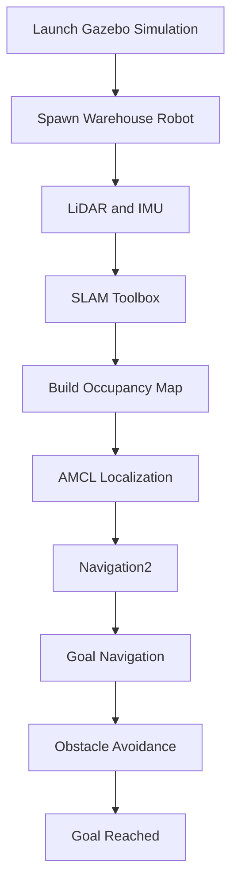
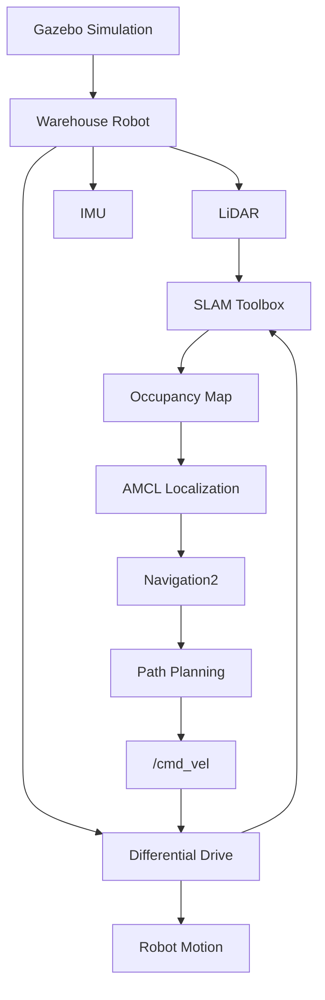

# 🤖 Autonomous Warehouse Robot

### Autonomous Warehouse Navigation using ROS 2 Humble


An autonomous mobile robot built with **ROS 2 Humble** to demonstrate the complete warehouse navigation pipeline. The robot maps its environment using **SLAM Toolbox**, localizes itself with **AMCL**, and autonomously navigates to user-defined goals with **Navigation2** while avoiding obstacles in a Gazebo simulation.

## 📌 Overview

Autonomous Warehouse Robot is a ROS 2 Humble–based robotics project that simulates autonomous warehouse navigation inside a Gazebo environment. It integrates robot modeling, mapping, localization, path planning, and motion control into a complete navigation pipeline.

The robot creates an occupancy map using **SLAM Toolbox**, estimates its position with **AMCL**, and autonomously navigates to user-defined destinations using **Navigation2**, while avoiding obstacles throughout its journey.

## ⭐ Project Highlights

- Designed a custom differential-drive mobile robot using **URDF** and **Xacro**
- Simulated the robot inside an **AWS RoboMaker warehouse** using **Gazebo Classic**
- Integrated **LiDAR** and **IMU** sensors for environment perception
- Performed real-time warehouse mapping using **SLAM Toolbox**
- Implemented localization with **AMCL**
- Enabled autonomous navigation using **Navigation2**
- Organized the project using a modular ROS 2 package structure

## 🔄 Execution Pipeline

The following pipeline illustrates how the robot perceives its environment, localizes itself, plans a path, and autonomously reaches a navigation goal.



## 🏗 System Architecture

The system is built on a modular ROS 2 architecture, where each component is responsible for a dedicated stage of the autonomous navigation workflow.



## ⚙ Prerequisites

Ensure the following software is installed before building the project:

- Ubuntu 22.04 LTS
- ROS 2 Humble
- Gazebo Classic
- Navigation2
- SLAM Toolbox
- colcon
- Git

## 🚀 Installation

Create a ROS 2 workspace and clone the repository.

```bash
mkdir -p ~/warehouse_robot_ws/src

cd ~/warehouse_robot_ws/src

git clone --recurse-submodules https://github.com/sneha-016/Autonomous-Warehouse-Robot.git .

cd ..

source /opt/ros/humble/setup.bash

colcon build

source install/setup.bash
```

## ▶️ Running the Project

Open a separate terminal for each process and source ROS 2 in every terminal.

### 1 — Launch the Warehouse Environment

```bash
source /opt/ros/humble/setup.bash
source ~/warehouse_robot_ws/install/setup.bash

gazebo ~/warehouse_robot_ws/install/aws_robomaker_small_warehouse_world/share/aws_robomaker_small_warehouse_world/worlds/no_roof_small_warehouse/no_roof_small_warehouse.world \
-s libgazebo_ros_init.so \
-s libgazebo_ros_factory.so \
-s libgazebo_ros_force_system.so
```

### 2 — Spawn the Robot

```bash
source /opt/ros/humble/setup.bash
source ~/warehouse_robot_ws/install/setup.bash

ros2 launch my_robot spawn.launch.py
```

### 3 — Manual Control

```bash
source /opt/ros/humble/setup.bash
source ~/warehouse_robot_ws/install/setup.bash

ros2 run teleop_twist_keyboard teleop_twist_keyboard
```

### 4 — SLAM Mapping

Use this only when creating a new map.

```bash
source /opt/ros/humble/setup.bash
source ~/warehouse_robot_ws/install/setup.bash

ros2 launch slam_toolbox online_async_launch.py use_sim_time:=true
```

Open RViz:

```bash
rviz2
```

Save the generated map:

```bash
ros2 run nav2_map_server map_saver_cli \
-f ~/warehouse_robot_ws/src/maps/warehouse_map
```

### 5 — Autonomous Navigation

Do not run SLAM Toolbox while using the saved map.

```bash
source /opt/ros/humble/setup.bash
source ~/warehouse_robot_ws/install/setup.bash

ros2 launch nav2_bringup bringup_launch.py \
use_sim_time:=true \
map:=~/warehouse_robot_ws/src/maps/warehouse_map.yaml
```

Open Nav2 RViz:

```bash
rviz2 -d /opt/ros/humble/share/nav2_bringup/rviz/nav2_default_view.rviz
```

In RViz:

1. Use **2D Pose Estimate** to set the robot's initial pose.
2. Use **Nav2 Goal** to select a destination.
3. Navigation2 plans and executes a collision-aware path to the goal.

## 📈 Future Improvements

- Camera integration for visual perception
- Pick-and-place task simulation
- Dynamic obstacle handling
- Multi-waypoint autonomous missions
- Multi-robot warehouse coordination
- Autonomous inventory management

## 👤 Author

**Sneha**

B.Tech Computer Science (Artificial Intelligence)
ABES Institute of Technology

📧 snehasinha0126@gmail.com

GitHub: https://github.com/sneha-016


